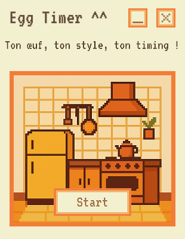
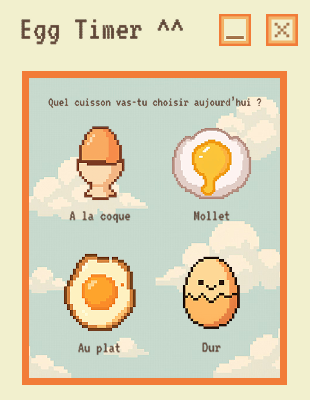
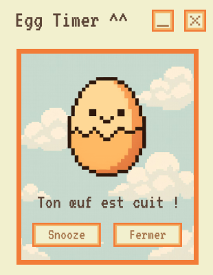

# 🥚 Egg Timer – Application Desktop Pixel Art

**Egg Timer** est une application desktop ludique et rétro en pixel art qui permet de choisir un type de cuisson d’œuf (coque, mollet, dur, plat), lancer un minuteur avec une animation et une musique dédiée, et recevoir une alerte à la fin.

---

## 📦 Fonctionnalités principales

- Interface **pixel art personnalisée** 🧑‍🎨
- 4 cuissons disponibles : coque, mollet, plat, dur
- Animations GIF différentes pour chaque cuisson
- Sons de clics et musiques thématiques pour chaque type d’œuf
- Minuteur intégré avec affichage dynamique
- Alerte sonore et animation de fin de cuisson
- Bouton "Snooze" pour relancer 2 minutes
- Version installable `.app` pour Mac
- Version portable `.exe` pour Windows (avec ou sans icône)

---

## 🖼️ Captures d’écran

> *(Ajoutez ici des captures d'écran du projet si vous le publiez sur GitHub ou ailleurs)*

## 🖼️ Captures d’écran

### Écran d’accueil


### Sélection de cuisson


### Minuteur en cours


### Fin de cuisson



## 🚀 Lancer l'application

### ▶️ Pour les développeurs

```bash
npm install
npm start
```

### 🧊 Pour packager une version Mac

```bash
npm run package-mac
```

### 💻 Pour packager une version Windows (nécessite Wine sur macOS)

```bash
npm run package-win
```

---

## 🛠️ Structure du projet

```
Eggtimer/
├── src/
│   ├── index.html
│   ├── style.css
│   ├── preload.js
│   └── renderer.js
├── assets/
│   ├── gifs/
│   ├── img/
│   ├── sounds/
│   └── svg/
├── icon.icns          # icône Mac
├── icon.ico           # icône Windows
├── main.js
├── package.json
└── README.md
```

---

## 📥 Téléchargements

- [EggTimer.app pour macOS](#)
- [EggTimer.exe pour Windows](#)
- [Version source (GitHub)](#)

---

## 🧑‍💻 Auteur

Projet réalisé par **[Ton nom ici]**  
N’hésitez pas à me contacter pour toute collaboration ou amélioration !

---

## 📝 Licence

Ce projet est sous licence MIT. Voir le fichier `LICENSE` pour plus d’informations.